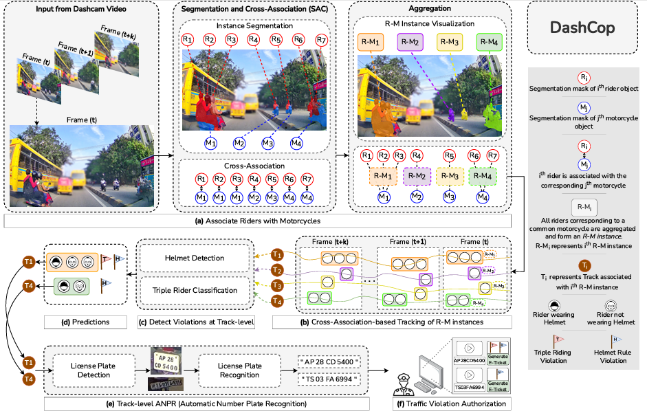

# DashCop

Hi everyone,

This repository provides the source code implementation of our work "DashCop: Automated E-ticket Generation for Two-Wheeler Traffic Violations Using Dashcam Videos."

As shown in the figure below, our methodology consists of four major components: the Segmentation and Cross-Association (SAC) module, the Cross-Association-based Tracking module, the Helmet/No-Helmet Detection module, and the Automatic Number Plate Recognition (ANPR) module.

To run inference on your videos, navigate to the `inference` directory. To understand the training procedure for each of these four modules, navigate to the `training` directory.

For queries regarding weight files and the dataset, contact:
`deepti.rawat@research.iiit.ac.in`
